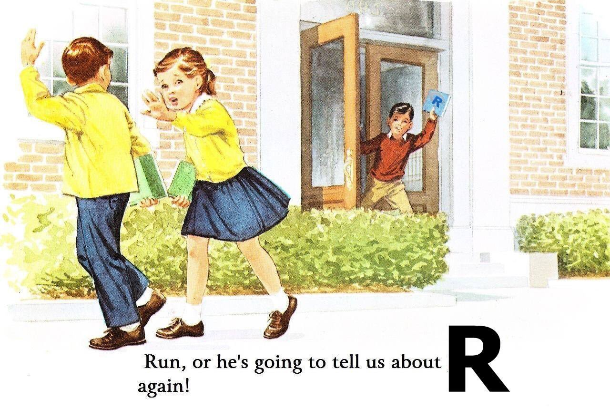

```{r, include=FALSE, echo=FALSE}

library(tidyverse)
library(palmerpenguins)
library(collapse)
library(ggforce)
library(plotly)

select <- collapse::fselect
mutate <- collapse::fmutate

print_plotly <- function(x){
 
 x %>% 
 layout(
  xaxis = list(range = list(-3.1, 3.1),
               showgrid = FALSE),
  yaxis = list(range = list(-2.1, 2.1),
               showgrid = FALSE)
 ) %>% 
 config(displayModeBar = FALSE) %>% 
 hide_legend()
 
}

knitr::opts_chunk$set(echo = FALSE, 
                      message = FALSE,
                      warning = FALSE,
                      dpi = 300,
                      fig.height = 7, 
                      fig.width = 11,
                      fig.align = 'center')

thm  <- theme_bw() + 
  theme(
    text = element_text(size=18, face = 'bold'),
    panel.grid = element_blank()
  )

theme_set(thm)

```

```{r xaringan-banner, echo=FALSE}

xaringanExtra::use_banner(
 top_left = "",
 top_right = "Byron C Jaeger",
 bottom_left = "byronjaeger.com/talk",
 exclude = c("inverse")
)

```

```{css, echo = FALSE}
.huge { font-size: 200% }
.large { font-size: 130% }
.small { font-size: 70% }
```

# Hello! My name is Byron 

.left-column[

I am an R enthusiast

I like walking my dog and learning (easy) cocktail recipes.

I study <br/> risk prediction using machine learning, generally cardiovascular disease.

]

.right-column[



]

---
class: center, middle, inverse

# .huge[Background]

---

## Penguin species

```{r}

penguins <- drop_na(palmerpenguins::penguins)

ggplot(data = penguins) +
  aes(x = bill_length_mm,
      y = bill_depth_mm, 
      label = species) +
  geom_point(aes(color = species, shape = species),
             size = 3,
             alpha = 0.8) +
  geom_mark_ellipse(aes(color = species, fill = species), 
                    alpha = 0.075) +
  theme_minimal() +
  scale_color_manual(values = c("darkorange", "purple", "cyan4")) +
  scale_fill_manual(values = c("darkorange", "purple", "cyan4")) +
  labs(x = "\nFlipper length, mm",
       y = "Bill length, mm\n") +
  coord_cartesian(ylim = c(12, 23),
                  xlim = c(30, 62)) +
  theme(panel.grid = element_blank(),
        legend.position = '')

```

---

## Oblique splitting

```{r}

penguins_01 <- penguins %>%
 mutate(species = recode(species,
                         'Gentoo' = 'Adelies and Chinstraps',
                         'Adelie' = 'Adelies and Chinstraps'))

simple_scale <- function(x) (x - mean(x))/sd(x)

penguins_scaled <- penguins_01 %>% 
 mutate(bill_length_mm = simple_scale(bill_length_mm), 
        bill_depth_mm = simple_scale(bill_depth_mm)) %>% 
 filter(bill_length_mm > -3, bill_length_mm < 3,
        bill_depth_mm > -2, bill_depth_mm < 2)

poly_1 <- data.frame(
 x = c(-3, -1.8, .8, -3, -3),
 y = c(-2, -2,   2, 2, -2)
)

poly_2 <- data.frame(
 x = c(-1.8, .8, 3, 3, -1.8),
 y = c(-2,   2, 2, -2, -2)
)

plot_ly(penguins_scaled, 
        x = ~ bill_length_mm, 
        y = ~ bill_depth_mm,
        color = ~ species,
        colors = c("orange", "purple"),
        width = 750, 
        height = 500) %>%
 add_markers() %>%
 add_polygons(data = poly_1,
              inherit = FALSE,
              x = ~ x, 
              y = ~ y,
              color = I('orange'),
              alpha = I(1/5)) %>% 
 add_polygons(data = poly_2,
              inherit = FALSE,
              x = ~ x, 
              y = ~ y,
              color = I('purple'),
              alpha = I(1/5)) %>% 
 print_plotly()


```

---

## Oblique splitting

```{r}

poly_2 <- data.frame(
 x = c(-1.15, .8, 3, 3, -1.15),
 y = c(-1, 2, 2, 1, -1)
)


poly_3 <- data.frame(
 x = c(-1.8, -1.15, 3, 3, -1.8),
 y = c(-2, -1, 1, -2, -2)
)

plot_ly(penguins_scaled, 
        x = ~ bill_length_mm, 
        y = ~ bill_depth_mm,
        color = ~ species,
        colors = c("orange", "purple"),
        width = 750, 
        height = 500) %>%
 add_markers() %>%
 add_polygons(data = poly_1,
              inherit = FALSE,
              x = ~ x, 
              y = ~ y,
              color = I('orange'),
              alpha = I(1/5)) %>%
 add_polygons(data = poly_2,
              inherit = FALSE,
              x = ~ x, 
              y = ~ y,
              color = I('purple'),
              alpha = I(1/5)) %>% 
 add_polygons(data = poly_3,
              inherit = FALSE,
              x = ~ x, 
              y = ~ y,
              color = I('orange'),
              alpha = I(1/5)) %>% 
 print_plotly()

```

---

## Permutation importance

```{r}

penguins_permute_init <- mutate(penguins_scaled, frame = 1)

penguins_permute_bill_length <- penguins_permute_init %>% 
 mutate(
  bill_length_mm = sample(bill_length_mm, size = nrow(.)),
  frame = 2
 )

penguins_permute <- bind_rows(
 penguins_permute_init,
 penguins_permute_bill_length
)

plot_ly(penguins_permute, 
        x = ~ bill_length_mm, 
        y = ~ bill_depth_mm,
        color = ~ species,
        frame = ~ frame,
        colors = c("orange", "purple"),
        width = 750, 
        height = 500) %>%
 add_markers() %>%
 add_polygons(data = poly_1,
              inherit = FALSE,
              x = ~ x, 
              y = ~ y,
              color = I('orange'),
              alpha = I(1/5)) %>%
 add_polygons(data = poly_2,
              inherit = FALSE,
              x = ~ x, 
              y = ~ y,
              color = I('purple'),
              alpha = I(1/5)) %>% 
 add_polygons(data = poly_3,
              inherit = FALSE,
              x = ~ x, 
              y = ~ y,
              color = I('orange'),
              alpha = I(1/5)) %>% 
 animation_opts(frame = 1000, transition = 1000) %>%
 animation_slider(hide = TRUE) %>% 
 animation_button(
  x = 0.95, xanchor = "right", 
  y = 0.05, yanchor = "bottom",
  label = "Permute\nbill length"
 ) %>% 
 print_plotly()

```


