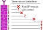

```{r, include=FALSE, echo=FALSE}

# 20 minute talk!!

library(gt)
library(aorsf)
library(plotly)
library(ggforce)
library(simsurv)
library(survival)
library(collapse)
library(tidyverse)
library(yardstick)
library(tidyselect)
library(SurvMetrics)
library(palmerpenguins)
library(randomForestSRC)

vi_sim_run <- function(n, p, runs,
                       correlated = TRUE,
                       x_effect = 1/5,
                       z_effect = 0,
                       categorical = FALSE){
 
 names_x <- paste0("x", seq(p))
 names_z <- paste0("z", seq(p))
 
 betas <- c(rep(x_effect, times = p), rep(z_effect, times = p))
 
 names(betas) <- c(names_x, names_z)
 
 permute_0 <- permute <- negate <- anova <- list()
 
 for(i in seq(runs)){
  
  print(i)
  
  predictors <- matrix(0, nrow = n, ncol = length(betas))
  
  colnames(predictors) <- c(names_x, names_z)
  
  for(j in seq(p)){
   
   predictors[, names_x[j] ] <- rnorm(n)
   if(correlated)
    predictors[, names_z[j] ] <- predictors[, names_x[j] ] + rnorm(n)
   else 
    predictors[, names_z[j] ] <- rnorm(n)
   
  }
  
  # cor(predictors)
  
  y_surv <- simsurv(lambdas = 0.1,
                    gammas = 1.5,
                    betas = betas,
                    x = as.data.frame(predictors),
                    maxt = 5)
  
  data <- cbind(y_surv, predictors)
  
  if(categorical){
   
   for(j in c(names_x, names_z)){
    
    q <- quantile(data[[j]], probs = c(0,1,2,3,4)/4)
    
    data[[j]] <- cut(data[[j]], 
                     breaks = q, 
                     include.lowest = TRUE)
    data[[j]] <- as.factor(data[[j]])
    data[[j]] <- factor(data[[j]],
                        levels = levels(data[[j]]),
                        labels = paste("group", 
                                       seq(length(levels(data[[j]]))),
                                       sep = '_'))
    
   }

  }
  
  fit_0 <- rfsrc(Surv(eventtime, status) ~ ., 
                 data = select(data, -id), 
                 importance = 'permute', 
                 samptype = 'swr')
  
  fit_aorsf <- orsf(data = data, 
                    eventtime + status ~ . - id, 
                    importance = 'anova')
  
  permute_0[[i]] <- fit_0$importance
  anova[[i]] <- orsf_vi(fit_aorsf, importance = 'anova')
  permute[[i]] <- orsf_vi(fit_aorsf, importance = 'permute')
  negate[[i]] <- orsf_vi(fit_aorsf, importance = 'negate')
  
 }
 
 bind_rows(
  rsf_permute = bind_rows(permute_0, .id = 'run'), 
  orsf_permute = bind_rows(permute, .id = 'run'),
  orsf_negate = bind_rows(negate, .id = 'run'),
  orsf_anova = bind_rows(anova, .id = 'run'),
  .id = 'model_vi'
 ) 
 
}

plotly_height <- 450
plotly_width <- 750
cols <- c("darkorange", "purple", "cyan4")

print_plotly <- function(x){
 
 x %>% 
  layout(
   xaxis = list(range = list(-3.1, 3.1),
                showgrid = FALSE,
                zerolinecolor = 'white',
                titlefont = list(size = 20),
                title = '<b>Bill length, scaled</b>',
                tickvals = list(-3, -2, -1, 0, 1, 2, 3)),
   yaxis = list(range = list(-2.1, 2.1),
                showgrid = FALSE,
                zerolinecolor = 'white',
                titlefont = list(size = 20),
                title = '<b>Bill depth, scaled</b>',
                tickvals = list(-2, -1, 0, 1, 2))
  ) %>% 
  config(displayModeBar = FALSE) %>% 
  style(hoverinfo = 'none') %>% 
  hide_legend()
 
}

knitr::opts_chunk$set(echo = FALSE, 
                      message = FALSE,
                      warning = FALSE,
                      dpi = 300,
                      cache = FALSE,
                      fig.height = 6.5, 
                      fig.width = 11,
                      fig.align = 'center')

```

```{r xaringan-banner, echo=FALSE}

xaringanExtra::use_banner(
 top_left = "",
 top_right = "Byron C Jaeger",
 bottom_left = "byronjaeger.com/talk",
 exclude = c("inverse")
)

```

```{css, echo = FALSE}
.huge { font-size: 200% }
.large { font-size: 130% }
.small { font-size: 70% }
```

# Hello! My name is Byron 

.left-column[

I am an R enthusiast

I like walking my dog and learning (easy) cocktail recipes.

I study <br/> risk prediction using machine learning, generally cardiovascular disease.

]

.right-column[


]

---
class: center, middle, inverse

# Decision Trees and Random Forests

---
background-image: url(img/penguins.png)
background-size: 45%
background-position: 85% 72.5%

## Decision trees

- Partition the space of predictor variables.

- Used in classification, regression, and survival analysis. 

- May be **axis-based** or **oblique** (more on this soon)

.pull-left[
We'll demonstrate the mechanics of decision trees by developing a prediction rule to classify penguin<sup>1</sup> species (chinstrap, gentoo, or adelie) based on bill depth and bill length.
]

.footnote[
<sup>1</sup>Data were collected and made available by [Dr. Kristen Gorman](https://www.uaf.edu/cfos/people/faculty/detail/kristen-gorman.php) and the [Palmer Station](https://pal.lternet.edu/), a member of the [Long Term Ecological Research Network](https://lternet.edu/).
]

---

## Penguins

Species have different patterns of bill depth versus length

```{r penguin-load}

penguins <- drop_na(palmerpenguins::penguins)

simple_scale <- function(x) (x - mean(x))/sd(x)

penguins_scaled <- penguins %>% 
 mutate(bill_length_mm = simple_scale(bill_length_mm), 
        bill_depth_mm = simple_scale(bill_depth_mm)) %>% 
 filter(bill_length_mm > -3, bill_length_mm < 3,
        bill_depth_mm > -2, bill_depth_mm < 2)

```

```{r penguin-first-plot}

ggplot(data = penguins_scaled) +
  aes(x = bill_length_mm,
      y = bill_depth_mm, 
      label = species) +
  geom_point(aes(color = species, shape = species),
             size = 3,
             alpha = 0.8) +
  geom_mark_ellipse(aes(color = species, fill = species), 
                    alpha = 0.075) +
  theme_minimal() +
  scale_color_manual(values = cols) +
  scale_fill_manual(values = cols) +
  labs(x = "\nBill length, scaled",
       y = "\nBill depth, scaled\n") +
  coord_cartesian(ylim = c(-2.5, 2.5),
                  xlim = c(-3, 3)) +
  theme(panel.grid = element_blank(),
        legend.position = '',
        text = element_text(size=20, face = 'bold'))

```

```{r forest-grid-set}

library(ranger)
library(obliqueRF)

grid <- expand_grid(
 bill_depth_mm = seq(-2, 2, len = 200),
 bill_length_mm = seq(-3, 3, len = 200)
)

```

```{r oblique-fit-penguin, cache=TRUE, include=FALSE}

x.test = as.matrix(grid)

mdl_oblique <- obliqueRF(
 x = as.matrix(penguins_scaled[, c('bill_depth_mm', 'bill_length_mm')]),
 y = as.matrix(as.numeric(penguins_scaled$species == 'Chinstrap'))
)

pred_oblique <- predict(mdl_oblique, newdata = x.test, type = 'prob')

colnames(pred_oblique) <- c("other", "Chinstrap")

grid_oblique <- bind_cols(grid, pred_oblique) %>% 
 pivot_longer(cols = c(other,
                       Chinstrap)) %>% 
 mutate(
  name = case_when(
   name == 'Chinstrap' ~ "Chinstrap",
   bill_depth_mm > bill_length_mm ~ "Adelie",
   TRUE ~ "Gentoo"
  )
 ) %>% 
 group_by(bill_depth_mm, bill_length_mm) %>% 
 arrange(desc(value)) %>% 
 slice(1)

```

```{r axis-fit-penguin}

mdl_forest <- ranger::ranger(
 formula = species ~ bill_depth_mm + bill_length_mm, 
 data = penguins_scaled,
 probability = TRUE,
 importance = 'permutation'
)

pred_ranger <- as_tibble(predict(mdl_forest, data = grid)$predictions)

grid_ranger <- bind_cols(grid, pred_ranger) %>% 
 pivot_longer(cols = c(Adelie,
                       Chinstrap,
                       Gentoo)) %>% 
 group_by(bill_depth_mm, bill_length_mm) %>% 
 arrange(desc(value)) %>% 
 slice(1)

```

---

## Axis based trees

Let's make an axis based tree:

```{r axis-split-1}

# run to get the cutpoints
# library(rpart)
# mdl_tree <- rpart(formula = species ~ bill_depth_mm + bill_length_mm,
#                   data = penguins_scaled, 
#                   control = rpart.control(maxdepth = 2))
# cut-points:
# first: bill_length_mm< 0.2116068
# second: bill_depth_mm< -0.4137976

p_init <- plot_ly(penguins_scaled, 
        x = ~ bill_length_mm, 
        y = ~ bill_depth_mm,
        color = ~ species,
        symbol = ~ species,
        colors = cols,
        width = plotly_width, 
        height = plotly_height) %>%
 add_markers() %>% 
 print_plotly()

p_init

```

---

## Axis based trees

If bill length (scaled) < .2, it's probably Adelie.

```{r axis-split-2}

poly_1_axis <- data.frame(
 x = c(-3, 0.2116068, 0.2116068, -3, -3),
 y = c(-2, -2,   2, 2, -2)
)

plot_ly(penguins_scaled, 
        x = ~ bill_length_mm, 
        y = ~ bill_depth_mm,
        color = ~ species,
        symbol = ~ species,
        colors = cols,
        width = plotly_width, 
        height = plotly_height) %>%
 add_markers() %>%
 add_polygons(data = poly_1_axis,
              inherit = FALSE,
              x = ~ x, 
              y = ~ y,
              color = I(cols[1]),
              alpha = I(1/5)) %>% 
 print_plotly()


```

---

## Axis based trees

Otherwise, bill depth < -.4 suggests Gentoo versus Chinstrap 

```{r axis-split-3}


poly_2_axis <- data.frame(
 x = c(0.2116068, 3, 3, 0.2116068, 0.2116068),
 y = c(-0.4137976, -0.4137976, -2, -2, -0.4137976)
)

poly_3_axis <- data.frame(
 x = c(0.2116068, 3, 3, 0.2116068, 0.2116068),
 y = c(2, 2, -0.4137976, -0.4137976, 2)
)

plot_ly(penguins_scaled, 
        x = ~ bill_length_mm, 
        y = ~ bill_depth_mm,
        color = ~ species,
        symbol = ~ species,
        colors = cols,
        width = plotly_width, 
        height = plotly_height) %>%
 add_markers() %>%
 add_polygons(data = poly_1_axis,
              inherit = FALSE,
              x = ~ x, 
              y = ~ y,
              color = I(cols[1]),
              alpha = I(1/5)) %>%
 add_polygons(data = poly_2_axis,
              inherit = FALSE,
              x = ~ x, 
              y = ~ y,
              color = I(cols[3]),
              alpha = I(1/5)) %>% 
 add_polygons(data = poly_3_axis,
              inherit = FALSE,
              x = ~ x, 
              y = ~ y,
              color = I(cols[2]),
              alpha = I(1/5)) %>%
 print_plotly()
```

---

## Axis based trees

Decision boundary from a random forest of axis based trees

```{r axis-forest-plot}

ggplot(grid_ranger, aes(bill_length_mm, bill_depth_mm)) +
 geom_point(data = penguins_scaled,
            aes(color = species, shape = species),
            size = 3,
            alpha = 0.8) + 
 geom_contour_filled(aes(z = value, fill = name), alpha = .25) +
 scale_color_manual(values = cols) +
 scale_fill_manual(values = cols) +
 labs(x = "\nBill length, scaled",
      y = "Bill depth, scaled\n") +
 theme_minimal() +
 scale_x_continuous(expand = c(0,0)) +
 scale_y_continuous(expand = c(0,0)) +
 theme(panel.grid = element_blank(),
       panel.border = element_rect(fill = NA),
       legend.position = '',
       text = element_text(size = 20))

```

---


## Oblique trees

If bill depth - 1.54 * bill length > 0.77, it's probably Adelie.

```{r oblique-split-1}

# points: (-1.8, -2) to (0.8, 2)
# m = 4/2.6 = 1.54
#   => -2 = 1.54 * -1.8 + b
#   => b = -2 + 1.54 * 1.8
# y = 1.54x + 0.77


poly_1_oblique <- data.frame(
 x = c(-3, -1.8, .8, -3, -3),
 y = c(-2, -2,   2, 2, -2)
)


plot_ly(penguins_scaled, 
        x = ~ bill_length_mm, 
        y = ~ bill_depth_mm,
        color = ~ species,
        symbol = ~ species,
        colors = cols,
        width = plotly_width, 
        height = plotly_height) %>%
 add_markers() %>%
 add_polygons(data = poly_1_oblique,
              inherit = FALSE,
              x = ~ x, 
              y = ~ y,
              color = I(cols[1]),
              alpha = I(1/5)) %>% 
 print_plotly()


```

---

## Oblique trees

Otherwise bill depth - .5 * bill length > -0.61 suggests Chinstrap versus Gentoo 

```{r oblique-split-2}

# points: (-1.35, -1.3) to (3, .9)
# m = 2.2 / 4.35 = .50575
#   => -1.3 = .50575 * -1.35 + b
#   => b = -1.3 + .50575 * 1.35 = -0.61
# y = .5x -0.61

poly_2_oblique <- data.frame(
 x = c(-1.35, .8,  3,  3, -1.35),
 y = c(-1.3,   2,  2, .9, -1.3)
)


poly_3_oblique <- data.frame(
 x = c(-1.8, -1.35, 3, 3, -1.8),
 y = c(-2,    -1.3, .9, -2, -2)
)

plot_ly(penguins_scaled, 
        x = ~ bill_length_mm, 
        y = ~ bill_depth_mm,
        color = ~ species,
        symbol = ~ species,
        colors = cols,
        width = plotly_width, 
        height = plotly_height) %>%
 add_markers() %>%
 add_polygons(data = poly_1_oblique,
              inherit = FALSE,
              x = ~ x, 
              y = ~ y,
              color = I(cols[1]),
              alpha = I(1/5)) %>%
 add_polygons(data = poly_2_oblique,
              inherit = FALSE,
              x = ~ x, 
              y = ~ y,
              color = I(cols[2]),
              alpha = I(1/5)) %>% 
 add_polygons(data = poly_3_oblique,
              inherit = FALSE,
              x = ~ x, 
              y = ~ y,
              color = I(cols[3]),
              alpha = I(1/5)) %>% 
 print_plotly()

```

---

## Oblique trees

Decision boundary from a random forest of oblique trees

```{r oblique-forest-plot}

ggplot(grid_oblique, aes(bill_length_mm, bill_depth_mm)) +
 geom_point(data = penguins_scaled,
            aes(color = species, shape = species),
            size = 3,
            alpha = 0.8) + 
 geom_contour_filled(aes(z = value, fill = name), alpha = .25) +
 scale_color_manual(values = cols) +
 scale_fill_manual(values = cols) +
 labs(x = "\nBill length, scaled",
      y = "Bill depth, scaled\n") +
 theme_minimal() +
 scale_x_continuous(expand = c(0,0)) +
 scale_y_continuous(expand = c(0,0)) +
 theme(panel.grid = element_blank(),
       panel.border = element_rect(fill = NA),
       legend.position = '',
       text = element_text(size = 20))

```

---

## Survival trees

Similar to classification trees, but predict survival curves instead of class probabilities

```{r}
knitr::include_graphics('img/rpart_plot_classif.png')
```

---

## Survival trees

Similar to classification trees, but predict survival curves instead of class probabilities

```{r}
knitr::include_graphics('img/rpart_plot_surv.png')
```

---
class: center, middle, inverse

# Oblique random survival forests (ORSF)

---

## Oblique random survival forests 

**Recipe**:

- Combine oblique trees with survival trees

- Follow Leo Breiman's rules for random forests

- Sprinkle on Torsten Hothorn's early stopping criteria


<br/>

**Software**:

- Original R package: *obliqueRSF*.

- Successor R package: *aorsf*

.footnote[

*obliqueRSF* paper [here](https://projecteuclid.org/journals/annals-of-applied-statistics/volume-13/issue-3/Oblique-random-survival-forests/10.1214/19-AOAS1261.full) --- *aorsf* paper [here](https://joss.theoj.org/papers/10.21105/joss.04705) --- *aorsf* documention [here](https://docs.ropensci.org/aorsf/) --- benchmark [here](https://arxiv.org/abs/2208.01129)

]

---

## Oblique random survival forests

Key things about *obliqueRSF*:

- High prediction accuracy

- High computational cost

- Few tools for interpretation (no variable importance)


---
class: center, middle
background-image: url("img/meme_slow_R.jpg")
background-size: contain

---

## Oblique random survival forests

Key things about *aorsf*:

- High prediction accuracy

- Comparable efficiency to `ranger` and `randomForestSRC`

- Three methods to compute variable importance

- fast partial dependence

- fast individual conditional expectation curves

- Integrated into *tidymodels* and *mlr3*


---

## Prove it...

```{r echo = TRUE}

library(mlr3verse)
library(mlr3proba)
library(mlr3extralearners)
library(mlr3benchmark)

```

```{r echo = FALSE, eval = FALSE}

library(magrittr)
library(aorsf)

# Mayo Clinic Primary Biliary Cholangitis Data
task_pbc <- 
 TaskSurv$new(
  id = 'pbc',  
  backend = select(pbc_orsf, -id) %>% 
   mutate(stage = as.numeric(stage)),  
  time = "time", 
  event = "status"
 )

# Veteran's Administration Lung Cancer Trial
data(veteran, package = "randomForestSRC")

task_veteran <- 
 TaskSurv$new(
  id = 'veteran',  
  backend = veteran,  
  time = "time", 
  event = "status"
 )

# NKI 70 gene signature
data_nki <- OpenML::getOMLDataSet(data.id = 1228)

task_nki <- 
 TaskSurv$new(
  id = 'nki',  
  backend = data_nki$data,  
  time = "time", 
  event = "event"
 )

# Gene Expression-Based Survival Prediction in Lung Adenocarcinoma
data_lung <- OpenML::getOMLDataSet(data.id = 1245)

task_lung <- 
 TaskSurv$new(
  id = 'nki',  
  backend = data_lung$data %>% 
   mutate(OS_event = as.numeric(OS_event) -1),  
  time = "OS_years", 
  event = "OS_event"
 )


# Chemotherapy for Stage B/C colon cancer
# (there are two rows per person, one for death 
#  and the other for recurrence, hence the two tasks)

task_colon_death <-
 TaskSurv$new(
  id = 'colon_death',  
  backend = survival::colon %>%
   filter(etype == 2) %>% 
   drop_na() %>% 
   # drop id, redundant variables
   select(-id, -study, -node4, -etype),
   mutate(OS_event = as.numeric(OS_event) -1),  
  time = "time", 
  event = "status"
 )

task_colon_recur <-
 TaskSurv$new(
  id = 'colon_death',  
  backend = survival::colon %>%
   filter(etype == 1) %>% 
   drop_na() %>% 
   # drop id, redundant variables
   select(-id, -study, -node4, -etype),
   mutate(OS_event = as.numeric(OS_event) -1),  
  time = "time", 
  event = "status"
 )

```

Code to make these tasks is [available here](https://docs.ropensci.org/aorsf/reference/orsf.html#mlr-pipelines)

```{r echo = TRUE, eval = FALSE}

tasks <- list(task_pbc,
              task_veteran,
              task_nki,
              task_lung,
              task_colon_death,
              task_colon_recur,
              # add a few pre-made mlr3 tasks
              tsk("actg"),
              tsk('gbcs'),
              tsk('grace'),
              tsk("unemployment"),
              tsk("whas"))

```

---

## Prove it...

```{r, echo = TRUE, eval = FALSE}

# Learners with default parameters
learners <- lrns(c("surv.ranger", "surv.rfsrc", "surv.aorsf"))

measures <- msrs(c("surv.graf",  # Brier (Graf) score, 
                   "surv.cindex",  # c-index (AUC) 
                   "surv.calib_alpha", # Calibration slope
                   "time_train")) # training time 

cv_folds <- rsmps("cv", folds = 10)

# Benchmark with CV
design <- benchmark_grid(tasks,
                         learners = learners,
                         resamplings = cv_folds)

# Run the benchmark
benchmark_result <- benchmark(design)

# Collect scores in testing data
bm_scores <- benchmark_result$score(measures,
                                    predict_sets = "test")

```

---

## Results

After running 10-fold cross validation on each of the 11 tasks, here is the mean discrimination (C-index) and calibration slope for each random forest method:

```{r, echo=FALSE}

# bm_scores %>%
#  select(task_id, learner_id, surv.graf, surv.calib_alpha, surv.cindex, time_train) %>%
#  group_by(learner_id) %>%
#  filter(!is.infinite(surv.graf)) %>%
#  summarize(
#   across(
#    .cols = c(surv.graf, surv.calib_alpha, surv.cindex, time_train),
#    .fns = mean,
#    na.rm = TRUE
#   )
#  )

rspec <- table.glue::round_spec() %>% 
 table.glue::round_using_decimal(digits = 2) %>% 
 set_names(paste('table.glue', names(.), sep = '.'))

options(rspec)

results <-
 structure(
  list(
   learner_id = c("surv.aorsf", "surv.ranger", "surv.rfsrc"),
   surv.cindex = c(0.737620677969871, 0.720416191521041, 0.729516897179665),
   surv.calib_alpha = c(1.00238069179152, 1.07155686381637, 0.993369810467202),
   surv.graf = c(0.151764745426444, 0.166625617753855, 0.155198621656336),
   time_train = c(0.345229357796072, 2.63165137614658, 0.855045871559206)
  ),
  row.names = c(NA, -3L),
  class = c("tbl_df", "tbl", "data.frame")
 ) %>% 
 arrange(desc(surv.cindex)) %>% 
 mutate(across(.cols = c(surv.cindex, surv.calib_alpha,
                         surv.graf, time_train),
               .fns = table.glue::table_value),
        learner_id = recode(learner_id, 
                            'surv.aorsf' = 'aorsf',
                            'surv.ranger' = 'ranger',
                            'surv.rfsrc' = 'randomForestSRC'))

results %>% 
 select(learner_id,
        surv.cindex,
        surv.calib_alpha) %>% 
 knitr::kable(col.names = c("Learner", 
                            "C-index (higher is better)",
                            "Calibration slope (1 is best)"),
              align = 'lcc') %>% 
 kableExtra::kable_material(lightable_options = c("hover"),
                            full_width = TRUE)

```

Notes: 
- All models used default values for tuning parameters

---

## Results

After running 10-fold cross validation on each of the 11 tasks, here is the mean Graf score (AKA Brier) and training time for each random forest method:

```{r}
results %>% 
 select(learner_id,
        surv.graf,
        time_train) %>%
 arrange(surv.graf) %>% 
 knitr::kable(col.names = c("Learner", 
                            "Graf score (lower is better)",
                            "Train time (lower is better)"),
              align = 'lcc') %>% 
 kableExtra::kable_material(lightable_options = c("hover"),
                            full_width = TRUE)

```

Notes: 
- All models used default values for tuning parameters
- Models were fit using 1 CPU
- Speed differences are affected by how data on survival curves are stored

---
class: center, middle, inverse

# Variable importance

---

## ANOVA importance

A fast method to compute variable importance with (some) oblique random forests:

For each predictor:

1. Compute p-values for each coefficient

1. Compute the proportion of p-values that are low (<0.01)

Importance of a predictor = the proportion of times its p-value is low.

---

## Permutation importance

For each predictor:

1. Permute predictor values

1. Measure prediction error with permuted values

Importance of a predictor = increase in prediction error after permutation

---

## Permutation importance

```{r permute-importance-1}

penguins_permute_init <- mutate(penguins_scaled, frame = 1)

penguins_permute_bill_length <- penguins_permute_init %>% 
 mutate(
  bill_length_mm = sample(bill_length_mm, size = nrow(.)),
  frame = 2
 )

penguins_permute <- bind_rows(
 penguins_permute_init,
 penguins_permute_bill_length
)

plot_ly(penguins_permute, 
        x = ~ bill_length_mm, 
        y = ~ bill_depth_mm,
        color = ~ species,
        symbol = ~ species,
        frame = ~ frame,
        colors = cols,
        width = plotly_width, 
        height = plotly_height) %>%
 add_markers() %>%
 add_polygons(data = poly_1_oblique,
              inherit = FALSE,
              x = ~ x, 
              y = ~ y,
              color = I(cols[1]),
              alpha = I(1/5)) %>%
 add_polygons(data = poly_2_oblique,
              inherit = FALSE,
              x = ~ x, 
              y = ~ y,
              color = I(cols[2]),
              alpha = I(1/5)) %>% 
 add_polygons(data = poly_3_oblique,
              inherit = FALSE,
              x = ~ x, 
              y = ~ y,
              color = I(cols[3]),
              alpha = I(1/5)) %>% 
 animation_opts(frame = 1000, transition = 1000) %>%
 animation_slider(hide = TRUE) %>% 
 animation_button(
  x = 0.95, xanchor = "right", 
  y = 0.05, yanchor = "bottom",
  label = "Permute\nbill length"
 ) %>% 
 print_plotly()

```

---

## Negation importance

For each predictor:

1. Multiply coefficient in linear combination by -1

1. Measure prediction error with permuted values

Importance of a predictor = increase in prediction error after negation

---

## Negation importance

```{r negate-importance-1}

poly_1_orig <- poly_1_oblique %>% 
 mutate(f = 1)

poly_1_flip_x <- mutate(poly_1_orig, x = -x, f = 2)

poly_1 <- bind_rows(poly_1_orig, poly_1_flip_x)

poly_2_orig <- poly_2_oblique %>% 
 mutate(f = 1)

poly_2_flip_x <- mutate(poly_2_orig, x = -x, f = 2)

poly_2 <- bind_rows(poly_2_orig, poly_2_flip_x)

poly_3_orig <- poly_3_oblique %>% 
 mutate(f = 1)

poly_3_flip_x <- mutate(poly_3_orig, x = -x, f = 2)

poly_3 <- bind_rows(poly_3_orig, poly_3_flip_x)

plot_ly(penguins_scaled, 
        x = ~ bill_length_mm, 
        y = ~ bill_depth_mm,
        color = ~ species,
        symbol = ~ species,
        colors = cols,
        width = plotly_width, 
        height = plotly_height) %>%
 add_markers() %>%
 add_polygons(data = poly_1,
              inherit = FALSE,
              x = ~ x, 
              y = ~ y,
              frame = ~ f,
              color = I(cols[1]),
              alpha = I(1/5)) %>%
 add_polygons(data = poly_2,
              inherit = FALSE,
              x = ~ x, 
              y = ~ y,
              frame = ~ f,
              color = I('purple'),
              alpha = I(1/5)) %>% 
 add_polygons(data = poly_3,
              inherit = FALSE,
              x = ~ x, 
              y = ~ y,
              frame = ~ f,
              color = I('cyan4'),
              alpha = I(1/5)) %>% 
 animation_opts(frame = 1000, transition = 1000) %>%
 animation_slider(hide = TRUE) %>% 
 animation_button(
  x = 0.95, xanchor = "right", 
  y = 0.05, yanchor = "bottom",
  label = "Negate\nbill depth\ncoefficients"
 ) %>% 
 print_plotly()

```

---
class: center, middle, inverse

# Variable importance:<br>oblique or axis based?

---

## Correlated predictors

Simulate correlated predictors.

- Two correlated predictors: $x_1$ and $z_1$

  ```{r echo = TRUE}
  
  x1 = rnorm(n = 500)
  z1 = x1 + rnorm(n = 500)
  
  cor(x1, z1)
  
  ```

---

## Correlated predictors

Simulate an outcome

- A survival outcome associated with $x_1$ but not $z_1$

  ```{r echo = TRUE}
  
  y_surv <- simsurv(lambdas = 0.1, 
                    gammas = 1.5,
                    betas = c(x1 = 1/5, z1 = 0),
                    x = data.frame(x1 = x1, z1 = z1),
                    maxt = 5)
  
  head(y_surv)
  
  ```
  
---

## Correlated predictors

Run an experiment.

- Make a dataset (n=500) with our simulated predictors and outcome.

- Using these data, apply four approaches to estimate variable importance:

    + Permutation importance with axis-based RSF
    
    + Permutation importance with oblique RSF
    
    + ANOVA importance with oblique RSF
    
    + Negation importance with oblique RSF

- **Correct answer**: assign higher importance to $x_1$ than $z_1$.

- **Question** Which approach has the lowest error?

```{r, eval = FALSE}

res_1 <- vi_sim_run(n = 500, p = 1, runs = 1000)
write_rds(res_1, 'index_cache_manual/vi_sim_res_1.rds')

res_2 <- vi_sim_run(n = 500, p = 50, runs = 1000)
write_rds(res_2, 'index_cache_manual/vi_sim_res_2.rds')

res_3 <- vi_sim_run(n = 500, p = 50, categorical = T, runs = 1000)
write_rds(res_3, 'index_cache_manual/vi_sim_res_3.rds')

```

---

## Correlated predictors

After running this experiment 1000 times, here is the percentage of runs where each  variable importance approach was incorrect:

```{r}

rspec <- table.glue::round_spec() %>% 
 table.glue::round_using_magnitude(digits = c(2, 1), 
                                   breaks = c(10, Inf)) %>% 
 set_names(paste('table.glue', names(.), sep = '.'))

options(rspec)

smry <- read_rds('index_cache_manual/vi_sim_res_1.rds') %>%
 group_by(model_vi) %>%
 summarize(correct = 100 * mean(z1 < x1)) %>% 
 arrange(desc(correct)) %>% 
 separate(model_vi, into = c('model', 'vi')) %>% 
 mutate(incorrect = 100-correct) %>% 
 select(-correct) 

smry %>% 
 mutate(ratio = incorrect / min(incorrect), 
        incorrect = table.glue::table_value(incorrect),
        ratio = table.glue::table_value(ratio),
        ratio = str_replace(ratio, "1.00", "Reference")) %>% 
 knitr::kable(col.names = c("Model", 
                            "Variable importance", 
                            "% Incorrect",
                            "Ratio"),
              align = "llcc") %>% 
 kableExtra::kable_material(lightable_options = c("hover"),
                            full_width = TRUE)

```

---

## Correlated predictors

Let's increase dimensions from 2 predictors to 100:

- 50 predictors $x_1, \ldots, x_{50}$ related to the outcome

- 50 predictors $z_1, \ldots, z_{50}$ unrelated to the outcome

- Each $z$ is correlated with the corresponding $x$

- **Correct answer**: assign higher importance to $x_i$ than all $z_i$.

- Which approach does best?

---

## Correlated predictors

After running this experiment 1000 times, here is the mean percentage of incorrect answers for each variable importance approach was incorrect:

```{r}

smry <- read_rds('index_cache_manual/vi_sim_res_2.rds') %>%
 pivot_longer(cols = -c(model_vi, run)) %>%
 mutate(true_var = factor(grepl('^x', name),
                          levels = c(FALSE, TRUE),
                          labels = c("junk", "signal"))) %>%
 group_by(model_vi, run) %>%
 roc_auc(truth = true_var, value, event_level = 'second') %>%
 group_by(model_vi) %>%
 summarize(incorrect = 100 - 100 * mean(.estimate)) %>% 
 separate(model_vi, into = c('model', 'vi')) %>% 
 arrange(incorrect)


smry %>% 
 mutate(ratio = incorrect / min(incorrect), 
        incorrect = table.glue::table_value(incorrect),
        ratio = table.glue::table_value(ratio),
        ratio = str_replace(ratio, "1.00", "Reference")) %>% 
 knitr::kable(col.names = c("Model", 
                            "Variable importance", 
                            "% Incorrect",
                            "Ratio"),
              align = "llcc") %>% 
 kableExtra::kable_material(lightable_options = c("hover"),
                            full_width = TRUE)

```

---

## Correlated and nominal

If we turn all the $x$ and $z$ variables into 4 categories, these are the results we get:

```{r}

smry <- read_rds('index_cache_manual/vi_sim_res_3.rds') %>%
 pivot_longer(cols = -c(model_vi, run)) %>%
 mutate(true_var = factor(grepl('^x', name),
                          levels = c(FALSE, TRUE),
                          labels = c("junk", "signal"))) %>%
 group_by(model_vi, run) %>%
 roc_auc(truth = true_var, value, event_level = 'second') %>%
 group_by(model_vi) %>%
 summarize(incorrect = 100 - 100 * mean(.estimate)) %>% 
 separate(model_vi, into = c('model', 'vi')) %>% 
 arrange(incorrect)


smry %>% 
 mutate(ratio = incorrect / min(incorrect), 
        incorrect = table.glue::table_value(incorrect),
        ratio = table.glue::table_value(ratio),
        ratio = str_replace(ratio, "1.00", "Reference")) %>% 
 knitr::kable(col.names = c("Model", 
                            "Variable importance", 
                            "% Incorrect",
                            "Ratio"),
              align = "llcc") %>% 
 kableExtra::kable_material(lightable_options = c("hover"),
                            full_width = TRUE)

```


---
class: inverse, center, middle

# Conclusions

---

## Oblique random survival forests

- Axis based trees and oblique trees are both useful.

- Axis based trees have gotten more attention. (faster, easier to interpret)

- This work makes oblique survival trees faster and easier to interpret

Variable importance

- Negation and ANOVA importance are unique to oblique random forests

- Both do well with correlated, numeric predictors


Software

- `aorsf` is fast and user-friendly. Give it a try!

```{r eval = FALSE, echo = TRUE}

# Open issues here: https://github.com/ropensci/aorsf/issues
# Install from CRAN
install.packages('aorsf')

```

---

## Thank you!

This research was supported by the Center for Biomedical Informatics, Wake Forest University School of Medicine and the National Center for Advancing Translational Sciences (NCATS), National Institutes of Health, through Grant Award Number UL1TR001420. The content is solely the responsibility of the authors and does not necessarily represent the official views of the NIH. 

---
background-image: url(img/orsf_collaborators.svg)
background-size: 90%

---

---
class: center, middle

# .huge[BONUS ROUND]

```{r}

mesa_aric <- 
 readr::read_csv('../aorsf-bench/data/mesa_and_aric.csv') %>% 
 filter(Race == 'W') %>% 
 select(-ID, -Race, -LVEF, -LVMi, -QTc, -CV, -LVHcv, -LVHsl, -LAnova) %>% 
 mutate(across(where(is.character), as.factor),
        Smoking = factor(Smoking),
        Alcohol = factor(Alcohol),
        NTproBNP = log(NTproBNP)) 

mesa <- filter(mesa_aric, database == 'mesa') %>% 
 select(-database,
        -VisitDate,
        -matches(".*_death$|.*_chd$|.*_stroke$")) %>% 
 drop_na()

aric <- filter(mesa_aric, database == 'aric') %>% 
 select(-database,
        -VisitDate,
        -matches(".*_death$|.*_chd$|.*_stroke$")) %>% 
 drop_na()

set.seed(329)


```

---

## Censoring

```{r out.width='90%', echo=FALSE, fig.align='center'}

```

---
class: middle

Discrimination and calibration of **models** for predicting 10-Year risk of developing heart failure in the **external validation cohorts among black adults**

```{r}

# Black adults

tribble(
 ~cohort, ~model, ~colname, ~value,
 "ARIC", "oRSF",	"C-statistic", "0.80",	
 "ARIC", "oRSF",	"GND P-value", "0.26",
 "ARIC", "oRSF",	"DeLong test P-value", "Ref",
 "MESA/DHS", "oRSF",	"C-statistic", "0.83",
 "MESA/DHS", "oRSF",	"GND P-value", "0.17",
 "MESA/DHS", "oRSF",	"DeLong test P-value", "Ref",
 "ARIC", "ARIC-HF risk score", "C-statistic",	"0.77",
 "ARIC", "ARIC-HF risk score", "GND P-value",	"0.35",
 "ARIC", "ARIC-HF risk score", "DeLong test P-value",	"<0.001",
 "MESA/DHS", "ARIC-HF risk score", "C-statistic",	"0.80",
 "MESA/DHS", "ARIC-HF risk score", "GND P-value",	"<0.001",
 "MESA/DHS", "ARIC-HF risk score", "DeLong test P-value",	"0.01",
 "ARIC", "PCP-HF risk score", "C-statistic", "0.73",
 "ARIC", "PCP-HF risk score", "GND P-value", "0.07",
 "ARIC", "PCP-HF risk score", "DeLong test P-value", "<0.001",
 "MESA/DHS", "PCP-HF risk score", "C-statistic", "0.75",
 "MESA/DHS", "PCP-HF risk score", "GND P-value", "0.04",
 "MESA/DHS", "PCP-HF risk score", "DeLong test P-value", "<0.001",
 "ARIC", "MESA-HF risk score", "C-statistic", "0.72",
 "ARIC", "MESA-HF risk score", "GND P-value", "0.55",
 "ARIC", "MESA-HF risk score", "DeLong test P-value", "<0.001",
 "MESA/DHS", "MESA-HF risk score", "C-statistic", "0.78",
 "MESA/DHS", "MESA-HF risk score", "GND P-value", "0.54",
 "MESA/DHS", "MESA-HF risk score", "DeLong test P-value", "0.006"
) %>% 
 pivot_wider(names_from = c(cohort, colname), values_from = value) %>% 
 gt(rowname_col = 'model') %>% 
 tab_spanner_delim(delim = '_') %>% 
 tab_stubhead("Model") %>% 
 cols_align('center') %>% 
 tab_source_note(
  html("ARIC indicates Atherosclerosis Risk in Communities; DHS, Dallas Heart Study; GND, Greenwood-Nam-D’Agostino; HF, heart failure; JHS, Jackson Heart Study; MESA, Multi-Ethnic Study of Atherosclerosis; ML, machine learning; PCP-HF, Pooled Cohort Equations-Heart Failure; and Ref, reference.<br/>The DeLong test of C-statistic compared other models with the oRSF model.")
 )

```

---
class: middle

Discrimination and calibration of **models** for predicting 10-year risk of developing heart failure in the **external validation cohorts (MESA & DHS) among white adults**

```{r}

# White adults

tribble(
 ~ model, ~colname, ~value,
 "oRSF", "C-statistic", "0.82",
 "oRSF", "GND P-value", "0.27",
 "oRSF", "DeLong test P-value", "Ref",
 "ARIC-HF risk score",	"C-statistic", "0.79",
 "ARIC-HF risk score",	"GND P-value", "0.001",
 "ARIC-HF risk score",	"DeLong test P-value", "0.008",
 "PCP-HF risk score", "C-statistic", "0.75",
 "PCP-HF risk score", "GND P-value", "0.01",
 "PCP-HF risk score", "DeLong test P-value", "<0.001",
 "MESA-HF risk score", "C-statistic", "0.80",
 "MESA-HF risk score", "GND P-value", "0.40",
 "MESA-HF risk score", "DeLong test P-value", "0.044"
) %>% 
 pivot_wider(names_from = c(colname), values_from = value) %>% 
 gt(rowname_col = 'model') %>% 
 tab_stubhead("Model") %>% 
 cols_align('center') %>% 
 tab_source_note(
  html("ARIC indicates Atherosclerosis Risk in Communities; DHS, Dallas Heart Study; GND, Greenwood-Nam-D’Agostino; HF, heart failure; JHS, Jackson Heart Study; MESA, Multi-Ethnic Study of Atherosclerosis; ML, machine learning; PCP-HF, Pooled Cohort Equations-Heart Failure; and Ref, reference.<br/>The DeLong test of C-statistic compared other models with the oRSF model.")
 )


```

---

## How do you use aorsf?

```{r echo=TRUE, cache=TRUE}

library(aorsf)
library(survival)
library(SurvMetrics)

fit <- orsf(data = aric, 
            formula = Surv(time_hf, censor_hf) ~ .,
            importance = 'negate')

preds <- predict(fit, 
                 new_data = mesa,
                 pred_type = 'surv',
                 pred_horizon = 10)

Cindex(with(mesa, Surv(time_hf, censor_hf)), 
       predicted = preds,
       t_star = 10)

```

---

```{r, echo=TRUE}

enframe(orsf_vi(fit))

```


---
## How do you use aorsf?

```{r, echo=TRUE, cache=TRUE}

pd <- fit %>% 
 orsf_pd_oob(
  pred_type = 'risk',
  pred_horizon = 10,
  pred_spec = list(Sex = c("F","M"), 
                   NTproBNP = seq(log(20), log(210), by = .2))
 )

as_tibble(pd)

```

---

## How do you use aorsf?

```{r}
ggplot(pd) + 
 aes(x = NTproBNP, y = mean, 
     color = fct_reorder2(Sex, .x = NTproBNP, .y = mean)) + 
 geom_line(size = 1.2) +
 theme_bw() +
 theme(panel.grid = element_blank()) +
 scale_color_manual(values = c("orange", "purple")) +
 labs(x = 'log NP levels',
      y = 'Mean predicted 10-year HF risk',
      color = 'Sex')
```


